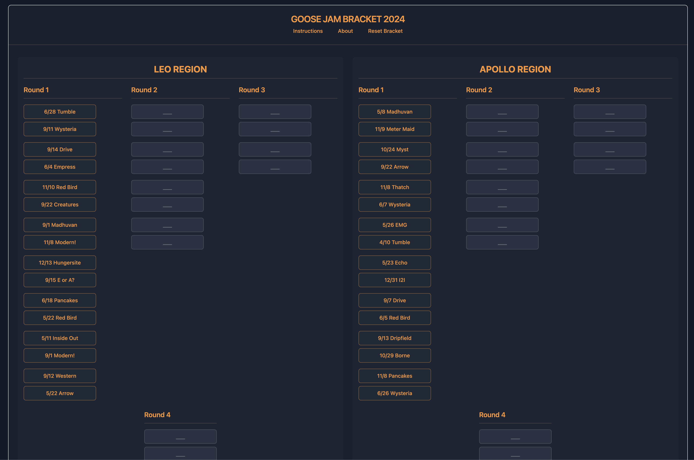

# Goose Jam Bracket 2024

An interactive tournament bracket for tracking and voting on the best Goose Jam performances of 2024. Inspired by Ryan Storm's Goose Jam of the Year [project](https://substack.com/home/post/p-153334990), this tool lets fans advance their favorite versions of songs through a tournament-style elimination bracket.

## Play

[View the demo](https://goose-bracket.vercel.app/)

## Features

- Interactive bracket UI with 4 regions (Leo, Apollo, Chiron, Manu)
- Automatic advancement of songs through tournament rounds
- Persistent state using localStorage
- Mobile-responsive design
- Reset functionality
- Tournament progression from Round 1 through Finals

## Demo



A tournament-style bracket for selecting your favorite Goose jams of 2024.

## Getting Started

### Prerequisites

- Node.js (v14 or later)
- npm
- A modern web browser

### Installation

1. Clone the repository:
```bash
git clone https://github.com/jesse-spevack/goose-bracket.git
cd goose-bracket
```

2. Install dependencies:
```bash
npm install
```

3. Install required shadcn/ui components:
```bash
npx shadcn-ui@latest add card
npx shadcn-ui@latest add button
```

4. Start the development server:
```bash
npm run dev
```

5. Open your browser and navigate to `http://localhost:3000`

## Project Structure

```
src/
  components/
    GooseBracket.tsx      # Main bracket component
  types/
    bracket.ts            # TypeScript types and interfaces
  utils/
    bracketUtils.ts       # Bracket logic utilities
    storageUtils.ts       # localStorage utilities
  ...
```

## Usage

1. Click on a song in any matchup to advance it to the next round
2. The selected song will appear in the next round's matchup
3. Continue selecting winners until you reach the championship
4. Use the Reset button to start over
5. Your progress is automatically saved in the browser

## Customization

### Adding New Regions

1. Add the region name to the `Region` type:
```typescript
type Region = 'leo' | 'apollo' | 'chiron' | 'manu' | 'newRegion';
```

2. Add initial matchups in the `INITIAL_BRACKET_DATA`:
```typescript
newRegion: [
  ["Song 1", "Song 2"],
  // ... more matchups
]
```

### Styling

The project uses Tailwind CSS for styling and models after the bracket on Ryan Storm's [Goose Jam of the Year](https://substackcdn.com/image/fetch/f_auto,q_auto:good,fl_progressive:steep/https%3A%2F%2Fsubstack-post-media.s3.amazonaws.com%2Fpublic%2Fimages%2F0a689a70-11e9-4575-8dfa-ddd5d2a86c57_3300x1800.jpeg) project.

## Contributing

1. Fork the repository
2. Create your feature branch (`git checkout -b feature/AmazingFeature`)
3. Commit your changes (`git commit -m 'Add some AmazingFeature'`)
4. Push to the branch (`git push origin feature/AmazingFeature`)
5. Open a Pull Request

## Dependencies

- React
- TypeScript
- Tailwind CSS
- shadcn/ui components

## License

This project is licensed under the MIT License - see the [LICENSE.md](LICENSE.md) file for details

## Acknowledgments

- Inspired by NCAA March Madness brackets
- Built for the Goose community
- Thanks to all contributors and fans who help make this better
